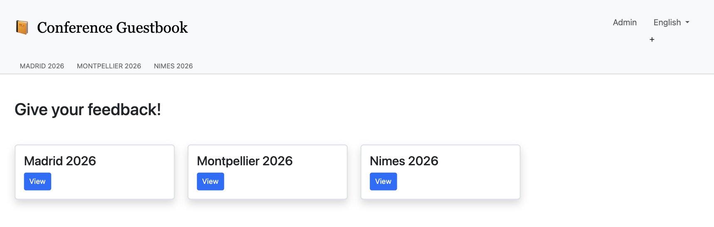
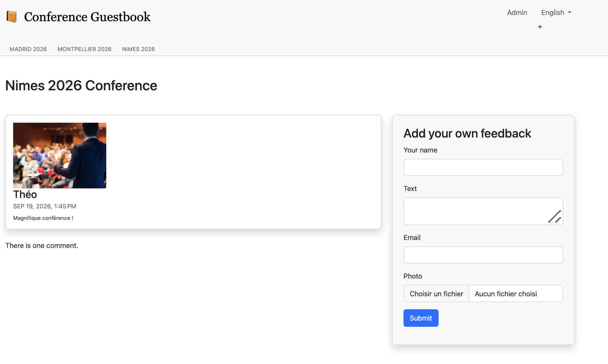
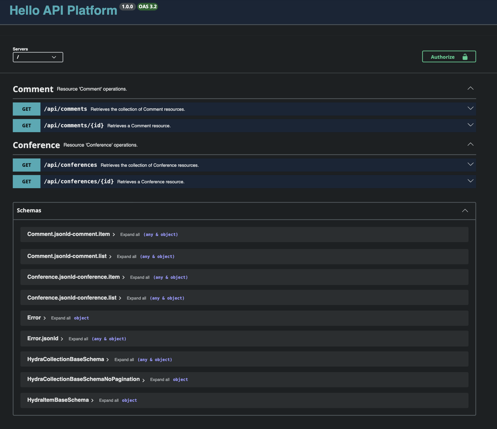

# Conference Guestbook — Symfony 8.1

Application web développée avec Symfony 8.1 autour d'un système de conférences et de commentaires.

Ce projet m'a permis d'approfondir l'écosystème Symfony à travers un cas concret : soumission et modération de commentaires, traitements asynchrones, notifications, API, cache, internationalisation et déploiement.

Le projet suit le fil conducteur du **Symfony Fast Track**. Mon objectif n'était pas simplement de reproduire le tutoriel, mais de comprendre, configurer, déboguer et faire fonctionner ensemble les différentes briques du framework, en local puis dans un environnement de production.

## Aperçu de l'application

### Accueil

La page d'accueil présente les différentes conférences disponibles.



### Consultation d'une conférence

Chaque conférence dispose de sa propre page permettant de consulter les commentaires publiés et d'en soumettre de nouveaux.



### API REST

Les conférences et commentaires sont également exposés via une API REST construite avec API Platform.



## Fonctionnalités principales

- Gestion de conférences et de commentaires avec Doctrine ORM
- Back-office d'administration avec EasyAdmin
- Authentification et contrôle d'accès
- Workflow de modération des commentaires
- Détection de spam avec Symfony AI et OpenAI
- Traitements asynchrones avec Symfony Messenger et RabbitMQ
- Notifications par email et Slack avec Symfony Notifier
- Redimensionnement des images avant publication
- Gestion des sessions et du cache avec Redis
- Cache HTTP avec Varnish
- API REST avec API Platform
- Interface dynamique avec Turbo et Stimulus
- Internationalisation français / anglais
- Tests avec PHPUnit, Foundry et Panther
- Environnement local Docker
- Déploiement sur Upsun

## Architecture générale

Le traitement d'un commentaire est volontairement découplé afin de ne pas faire dépendre la réponse HTTP de traitements potentiellement longs.

```text
Utilisateur
    │
    ▼
ConferenceController
    │
    ├── Validation du formulaire
    ├── Enregistrement du commentaire
    │
    ▼
Symfony Messenger
    │
    ▼
RabbitMQ
    │
    ▼
CommentMessageHandler
    │
    ├── Analyse anti-spam
    ├── Workflow de modération
    ├── Optimisation éventuelle de l'image
    │
    └── Notification de l'administrateur
            │
            ├── Email
            └── Slack
```

L'objectif de cette architecture est notamment d'éviter que des opérations lentes, comme un appel à une API externe, le traitement d'une image ou l'envoi d'une notification, ne bloquent la requête HTTP de l'utilisateur.

## Stack technique

**Backend :** PHP 8.5, Symfony 8.1, Doctrine ORM, PostgreSQL

**Asynchrone :** Symfony Messenger, RabbitMQ

**Cache et sessions :** Redis, cache HTTP, Varnish

**Frontend :** Twig, Bootstrap, AssetMapper, Turbo, Stimulus

**API :** API Platform

**Services externes :** Symfony AI / OpenAI, Symfony Mailer, Symfony Notifier, Slack

**Tests :** PHPUnit, Zenstruck Foundry, Panther

**Infrastructure :** Docker, Upsun

## Points techniques approfondis

### Symfony Messenger et RabbitMQ

Lorsqu'un commentaire est soumis, il est d'abord enregistré en base de données. Un message est ensuite envoyé via Symfony Messenger.

RabbitMQ joue le rôle de **message broker** : il conserve les messages dans une file d'attente jusqu'à ce qu'un worker Messenger les consomme.

```text
Requête HTTP
    ↓
Commentaire enregistré
    ↓
Message envoyé à RabbitMQ
    ↓
Réponse HTTP rendue à l'utilisateur

En parallèle :

RabbitMQ
    ↓
Worker Messenger
    ↓
Traitement du commentaire
```

Cette architecture permet de sortir les traitements longs du cycle de la requête HTTP.

### Workflow de modération

Le cycle de vie d'un commentaire est modélisé avec Symfony Workflow.

Un commentaire passe par plusieurs états avant sa publication ou son rejet.

```text
submitted
    ↓
ham / potential_spam / spam
    ↓
ready
    ↓
published / rejected
```

Les changements d'état passent par des **transitions explicites**, ce qui permet de centraliser les règles métier au lieu de modifier directement la propriété `state` à différents endroits du code.

### Détection de spam

Les nouveaux commentaires sont analysés avec **Symfony AI** et l'API OpenAI.

Le résultat de l'analyse permet au workflow de déterminer la transition à appliquer :

- commentaire légitime ;
- commentaire potentiellement indésirable ;
- spam manifeste.

L'appel à l'API étant réalisé par un worker Messenger, l'utilisateur n'a pas besoin d'attendre la réponse du modèle pendant la soumission du formulaire.

### Modération et notifications

Lorsqu'une validation humaine est nécessaire, Symfony Notifier permet de prévenir l'administrateur.

Deux canaux ont été mis en place :

- email ;
- Slack.

Les notifications Slack peuvent contenir des actions permettant d'accepter ou de rejeter directement un commentaire.

Cela m'a permis de travailler avec :

- Symfony Notifier ;
- Symfony Mailer ;
- Slack API ;
- Messenger pour l'envoi asynchrone des notifications.

### Traitement des images

Les utilisateurs peuvent joindre une photo à leur commentaire.

Avant publication, le fichier peut être redimensionné afin d'éviter de conserver et servir des images inutilement volumineuses.

Le traitement est effectué par le worker Messenger avant le passage du commentaire à l'état `published`.

### Redis

Redis est utilisé comme service externe à l'application, notamment pour la gestion des sessions et certains mécanismes de cache.

Cette partie m'a permis de mieux comprendre la différence entre :

- stockage persistant en base de données ;
- cache en mémoire ;
- session utilisateur ;
- services accessibles via des variables d'environnement.

### Cache HTTP et Varnish

Le projet utilise les mécanismes de cache HTTP de Symfony et Varnish en production.

Le principe est de servir directement une réponse mise en cache lorsque celle-ci est encore valide, sans exécuter systématiquement toute l'application Symfony.

```text
Client
   ↓
Varnish
   ↓
Réponse en cache ?
   ├── Oui → réponse immédiate
   │
   └── Non → Symfony → réponse → mise en cache
```

Les ESI permettent également de mettre en cache différents fragments d'une même page indépendamment.

### API Platform

API Platform expose une API REST permettant notamment d'accéder aux conférences et aux commentaires.

La documentation interactive est accessible via :

```text
/api
```

Des groupes de sérialisation permettent de contrôler les propriétés exposées.

Une extension Doctrine est également utilisée afin de garantir que seuls les commentaires ayant atteint l'état `published` soient accessibles publiquement via l'API.

### Symfony UX

Le projet utilise **Turbo** et **Stimulus**.

Turbo améliore la navigation en évitant certains rechargements complets de page.

Stimulus permet d'ajouter de petits comportements JavaScript ciblés sans construire une application frontend séparée.

Il est notamment utilisé pour afficher un aperçu d'une image sélectionnée avant l'envoi du formulaire.

### Internationalisation

L'interface est disponible en anglais et en français.

Symfony Translation est utilisé pour :

- traduire les textes de l'interface ;
- gérer les pluriels ;
- adapter les dates et nombres à la locale ;
- intégrer la langue directement dans les URLs.

Exemples :

```text
/en/
/fr/
```

## Lancer le projet en local

### Prérequis

- PHP 8.5
- Composer
- Symfony CLI
- Docker

### Installation

Cloner le dépôt :

```bash
git clone https://github.com/theodev23/symfony-guestbook.git
cd symfony-guestbook
```

Installer les dépendances PHP :

```bash
composer install
```

Démarrer les services Docker :

```bash
docker compose up -d
```

Créer la base de données si nécessaire :

```bash
symfony console doctrine:database:create
```

Appliquer les migrations :

```bash
symfony console doctrine:migrations:migrate
```

Démarrer le serveur Symfony :

```bash
symfony server:start -d
```

L'application est alors accessible via l'URL indiquée par Symfony CLI.

### Lancer le worker Messenger

Les traitements asynchrones nécessitent un worker :

```bash
symfony console messenger:consume async -vv
```

Le worker doit rester actif pendant les tests des fonctionnalités asynchrones.

## Tests

La suite de tests peut être lancée avec :

```bash
make tests
```

Le projet utilise notamment :

- PHPUnit ;
- Zenstruck Foundry ;
- Panther.

Les tests couvrent différentes couches de l'application, des services aux scénarios fonctionnels.

## Configuration et secrets

Les clés d'API et identifiants sensibles ne sont pas versionnés dans le dépôt.

Selon les fonctionnalités utilisées, certaines valeurs doivent être configurées localement, notamment :

```text
OPENAI_API_KEY
SLACK_DSN
ADMIN_EMAIL
```

Symfony Secrets et les variables d'environnement permettent de séparer la configuration sensible du code source.

Les clés privées de déchiffrement ne doivent jamais être versionnées.

## Déploiement

L'application a également été déployée sur **Upsun**.

L'environnement de production comprend notamment :

```text
Application Symfony
├── PostgreSQL
├── Redis
├── RabbitMQ
├── Worker Messenger
├── Varnish
└── Stockage partagé
```

Cette partie du projet m'a permis de travailler sur la différence entre :

- environnement local ;
- environnement de test ;
- environnement de production ;
- configuration applicative ;
- configuration d'infrastructure.

## Difficultés rencontrées et apprentissages

Une partie importante du projet a consisté à résoudre des problèmes qui n'étaient pas directement liés à l'écriture du code métier.

J'ai notamment dû travailler sur :

- la configuration de services Docker ;
- les différences entre les versions des outils et la documentation ;
- le fonctionnement des workers longue durée ;
- la configuration de RabbitMQ ;
- les extensions PHP nécessaires à certains services ;
- le cache HTTP ;
- les variables d'environnement ;
- les secrets Symfony ;
- les tunnels SSH vers les services Upsun ;
- le déploiement et le diagnostic d'erreurs en production.

Ces difficultés ont constitué une partie importante de l'intérêt du projet, car elles m'ont permis d'aller au-delà de l'écriture de contrôleurs et de templates pour mieux comprendre l'environnement dans lequel fonctionne une application Symfony.

## Contexte du projet

Ce projet a été réalisé dans le cadre de mon apprentissage approfondi de Symfony.

Il s'appuie sur le livre officiel **Symfony Fast Track**, que j'ai utilisé comme fil conducteur afin de découvrir progressivement les composants du framework et leur intégration dans une application complète.

L'objectif était avant tout de comprendre les concepts abordés et de les faire fonctionner concrètement : Doctrine, sécurité, formulaires, Messenger, Workflow, Notifier, API Platform, Symfony UX, cache, Redis, RabbitMQ ou encore le déploiement.

Le travail de configuration, de débogage et d'intégration des différentes briques a constitué une partie importante de cet apprentissage.

## Auteur

**Théo Devarenne**

Étudiant en Master Informatique à l'Université de Montpellier

GitHub : [@theodev23](https://github.com/theodev23)